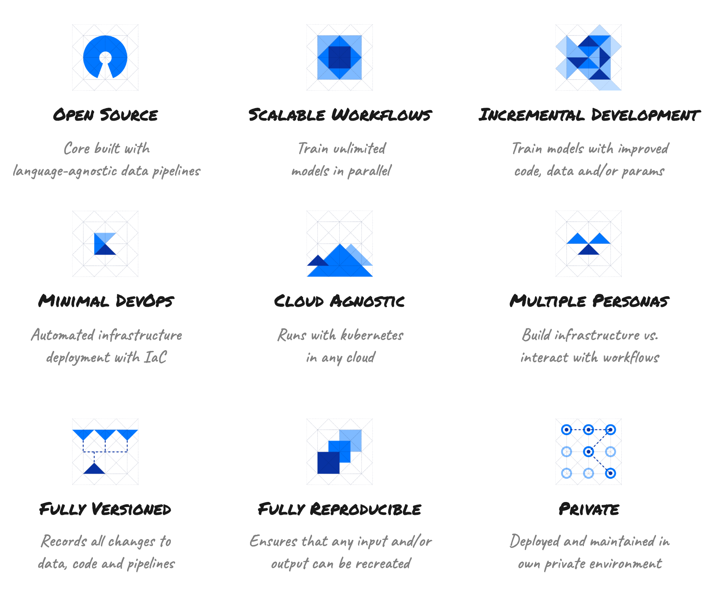

# kaos
<!---
-->
### What is kaos?
kaos is **the** platform for deploying **scalable reproducible machine learning workflows in your own private environment.**

##
### Why kaos?

Check out our [motivation](https://ki-labs.gitbook.io/kaos/motivation) for developing our own platform for **simplifying** both **ML DevOps** and enforcing **reproducible Data Science workflows**.

##
### Quick Start

Train, serve and predict in your **own** running cluster with [8 commands!](https://ki-labs.gitbook.io/kaos/getting-started/quick-start)

##
### Features

<!---
* **Scalable Machine Learning Workflows**
  * _Train unlimited models in parallel_
* **Incremental Development**
  * _Train models with improved code, data and/or params_
* **Minimal DevOps**
  * _Automated infrastructure deployment with IaC_
* **Cloud Agnostic**
  * _Runs with kubernetes in any cloud_
* **Open Source**
  * _Core built with language agnostic data pipelines_
* **Multiple Personas**
  * _Build infrastructure vs. interact with workflows_
* **Fully Versioned**
  * _Records all changes to data, code and pipelines_
* **Fully Reproducible**
  * _Ensures that any input and/or output can be recreated_
* **Private**
  * _Deployed and maintained in own environment_
 -->
 
## 
### Documentation

Check out our [Official Documentation](https://ki-labs.gitbook.io/kaos)

##

### Get Involved

- Check the [Changelog](https://ki-labs.gitbook.io/kaos/miscellaneous/changelog) for release information
- Visit the [Public Roadmap](https://ki-labs.gitbook.io/kaos/miscellaneous/roadmap) to see what's coming next
- Help improve kaos by following our [Contribution Guide](.github/CONTRIBUTING.md)
