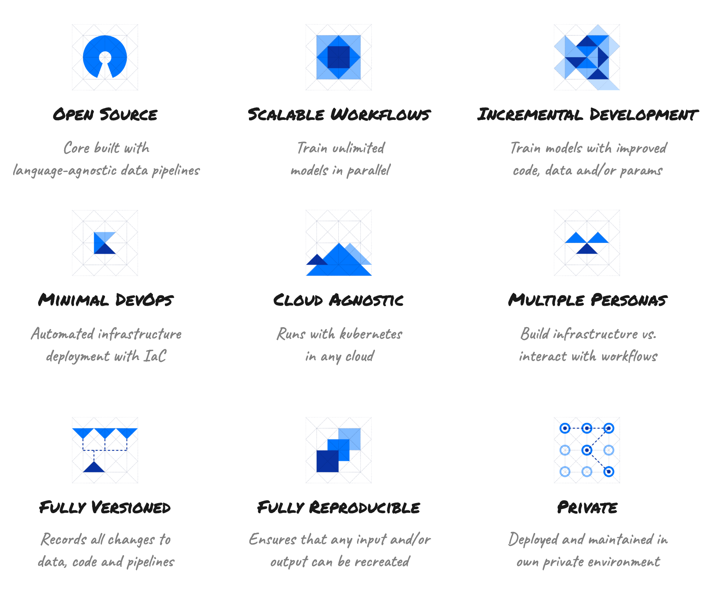

# kaos

## What is kaos?

kaos is **the** platform for deploying **scalable reproducible machine learning workflows in your own private environment.**

## Why kaos?

Check out our [**motivation**](motivation/) for developing our own platform for **simplifying** both **ML** **DevOps** and enforcing **reproducible Data Science workflows**.

## Quick Start

Train, serve and predict in your **own** running cluster with [**8 commands!**](getting-started/quick-start.md)

## Features

## Support

* Check the [**Changelog**](miscellaneous/changelog.md) for release information
* Visit the [**Public Roadmap**](miscellaneous/roadmap.md) to see what's coming next
* Bugs, issues and contributions should be created on [**GitHub**](https://github.com/KI-labs/kaos/issues/new/choose)

## Community

* Send us a [**mail**](mailto:kaos@ki-labs.com) for specific feedback
* Join us on our [**slack workspace**](https://kaos-slack-inviter.herokuapp.com) for user discussion
* Follow us on [**twitter**](https://twitter.com/intent/follow?screen_name=kaos_ml) for the latest updates

