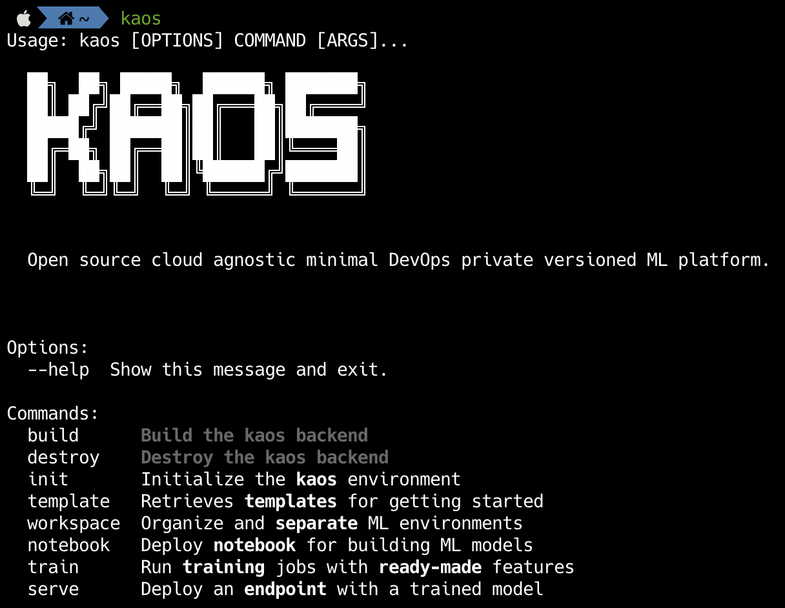

# 🐳 Docker Install


Docker installation of kaos is **only** available for [**Data Scientists**](../../usage/high-level-usage/#kaos-personas)**.**


## Requirements

The kaos command-line utility is used for all interactions. It is lightweight but **requires** the following.



* [**docker**](https://docs.docker.com/install/linux/docker-ce/ubuntu/) for isolation of kaos \(system-dependent\)
  * **macOS** → `brew install docker`
  * **Linux**    → `apt-get install docker`



## Installation

kaos supports installation methods based on the desired simplicity and environment.


Note that the following installation steps assume the kaos repository is accessed by **HTTPS**


A **docker** installation of kaos is completed by building the supplied Dockerfile. The following commands will yield a successful **isolated** installation of kaos.

```bash
alias kaos="docker run -it --rm -v $(pwd):/kaos -e USER=${USER} kilabs/kaos:latest"
```


The **docker** installation of kaos will **underperform** given the additional isolation "layers" and does not support any [Local](../deploying-infrastructure/#local) clusters.



The default docker installation **only mounts the current directory** - additional volumes can always be included to the kaos alias. See [`docker run`](https://docs.docker.com/storage/volumes/) for more information.


### Successful Installation

Running `kaos` will greet the user with the following response.



Refer to [**Quick Start**](../quick-start.md#2-create-a-workspace) for hands-on experience with training and serving a model within kaos.

