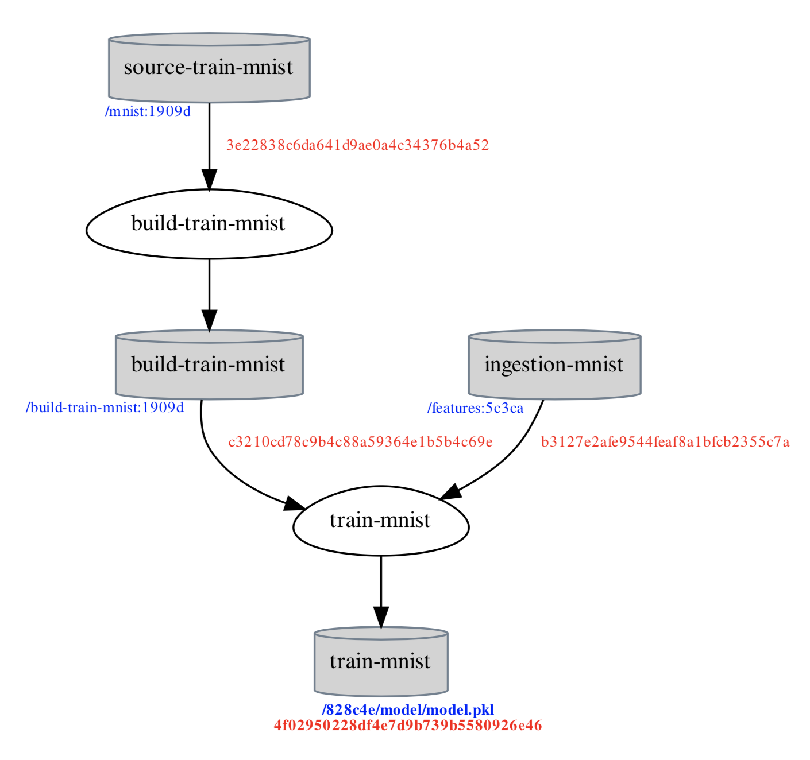
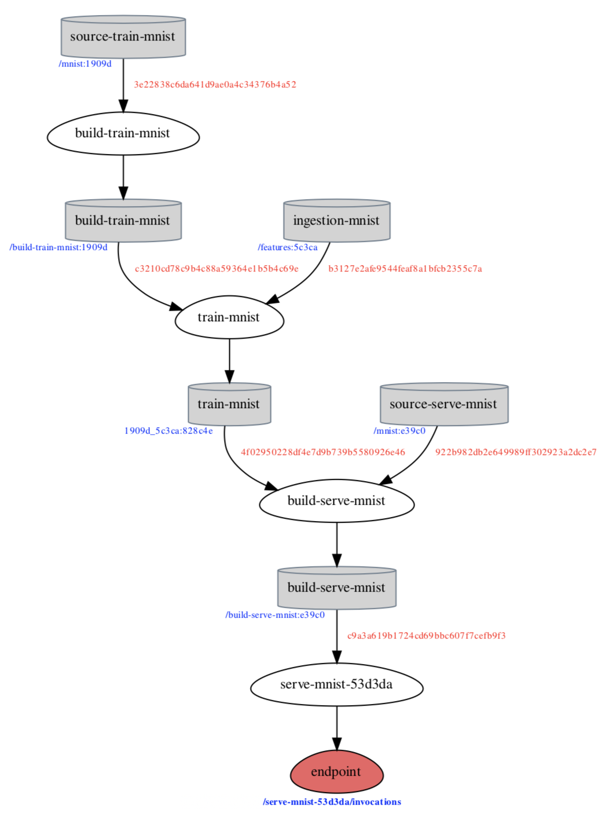

# Quick Start


Note that Quick Start **assumes** kaos is properly [**installed**](installation/)


This **Quick Start** trains and serves a machine learning model to classify images based on the [MNIST dataset](../advanced-workflows/examples/#mnist-dataset). A more in-depth explanation of the dataset is explained in [Examples](../advanced-workflows/examples/).

Quick Start is separated based on the assumed persona - **Data Scientist** vs. **Superhero**. Check [kaos personas](../usage/high-level-usage/#kaos-personas) for more information.

## 1. Connect to Cluster

> **A running cluster is an absolute necessity for interacting with kaos.**



The kaos ML platform is fully functional when initialized with a **running endpoint** \(instructions below\). Further instructions on acquiring a shared endpoint are detailed [here](../usage/high-level-usage/infrastructure-deployment.md#sharing-running-endpoint).

```text
$ kaos init -e <running_endpoint>
Token:

Info - kaos successfully connected to <running_endpoint>
```


The output from `kaos init` indicates that the user is **successfully connected to a running endpoint**. Note that this endpoint can be shared for collaborative development!




kaos is **not** functional until its infrastructure has been deployed via `kaos build`. Refer to [Deploying Infrastructure](deploying-infrastructure/#local) for additional instructions.


Note that the ENV `KAOS_HOME` is **required irrespective of cloud provider.**


```text
$ kaos build -c DOCKER -vf

Warning - Performing force build of the backend
Warning - Are you sure about building kaos backend in DOCKER? [y/N]

...

Apply complete! Resources: 21 added, 0 changed, 0 destroyed.

Info - Endpoint successfully set to http://localhost:80/api/
Info - Successfully built kaos environment
```


The output from `kaos build` is a **successfully running endpoint**. Note that this endpoint can be shared for collaborative development!


Further info on sharing a running endpoint is detailed [here](../usage/high-level-usage/infrastructure-deployment.md#sharing-running-endpoint).



## 2. Create a workspace

> **A kaos workspace is required for ensuring collaborative provenance for a particular model.**

A workspace is **required** within kaos for organizing multiple environments and code. Refer to [Workspaces](../usage/high-level-usage/ml-deployment/workspaces.md) for additional information.

```text
$ kaos workspace create -n mnist

Info - Successfully set mnist workspace
```


Workspaces can also be shared for collaboration with `kaos workspace set`


## 3. Load the MNIST template

> **Local kaos templates are available for quick deployment.**

kaos is supplied with various templates \(including MNIST\) for ensuring simplicity in training and serving own models.

```text
$ kaos template get --name mnist

Info - Successfully loaded mnist template
```


Additional templates can be found by running `kaos template list`


## 4. Deploy a training job

> **Deploying a training job within kaos spawns a Build and Train pipeline.**

The training pipeline **requires** at least a valid source and data bundle. Refer to [Train Pipeline](../usage/high-level-usage/ml-deployment/train-pipeline.md) for additional information. Note that additional [resource options](../usage/high-level-usage/ml-deployment/train-pipeline.md#resources-optional) can be specified to speed up training.

```text
$ kaos train deploy -s templates/mnist/model-train \
                    -d templates/mnist/data

Info - Submitting source bundle: templates/mnist/model-train
Compressing source bundle: 100%|███████████████████████████|
  Uploading source bundle: 100%|███████████████████████████|
 ✔ Setting source bundle: /mnist:1909d

Info - Submitting data bundle: templates/mnist/data
Compressing data bundle: 100%|███████████████████████████|
  Uploading data bundle: 100%|███████████████████████████|
 ✔ Setting data bundle: /features:5c3ca

CURRENT TRAINING INPUTS

+------------+-----------------+-------------+
|   Image    |       Data      | Hyperparams |
+------------+-----------------+-------------+
|     -      |        ✔        |      ✗      |
| <building> | /features:5c3ca |             |
+------------+-----------------+-------------+
```


The status of the training job can be queried with `kaos train list`


## 5. Identify the trained model

> **Information of a successfully trained in kaos yields inputs, outputs and \(optionally\) metrics.**

The \(upcoming\) serve pipeline **requires** at least a valid source and a trained model. The [previously](quick-start.md#command-4-train-mnist) trained model can be identified by the information from the **last** trained model. Further details regarding the different states are listed [here](../usage/high-level-usage/ml-deployment/states.md#training-jobs-and-all-build-jobs).

```text
$ kaos train info -i 0

Info - Retrieving info from eb9617c2032f46e99de48eeac358231b

    Job ID: eb9617c2032f46e99de48eeac358231b
    Process time: 130s
    State: JOB_SUCCESS
    Available metrics: ['accuracy_test', 'accuracy_validation', 'accuracy_train']

    Page count: 1
    Page ID: 0
+-----+--------------------+-----------------------+--------------------+
| ind |        Code        |          Data         |      Model ID      |
+-----+--------------------+-----------------------+--------------------+
|  0  | Author: jfriedman  |   Author: jfriedman   | 1909d_5c3ca:828c4e |
|     | Path: /mnist:1909d | Path: /features:5c3ca |                    |
+-----+--------------------+-----------------------+--------------------+
```


The author of individual inputs **ensures accountability** when collaborating


#### \(Optional\) Check model provenance

> Provenance from a trained model aids in identifying **actual** training inputs

All inputs used for training \(including commits\) are available via `kaos train provenance`.

```text
$ kaos train provenance -m 1909d_5c3ca:828c4e -o mnist/

Info - Retrieving provenance from 1909d_5c3ca:828c4e
```



## 6. Serve the trained model

> **The trained model should now be "served" via a running endpoint for live predictions.**

Deploying a **running endpoint** requires the [previously](quick-start.md#command-5-identify-the-trained-model) identified Model ID. Refer to [Serve Pipeline](../usage/high-level-usage/ml-deployment/serve-pipeline.md) for additional information. Note that additional [resource options](../usage/high-level-usage/ml-deployment/serve-pipeline.md#resources-optional) can be specified to handle intended traffic.

```text
$ kaos serve deploy -s templates/mnist/model-serve \
                    -m 1909d_5c3ca:828c4e

Submitting source bundle: templates/mnist/model-serve
Compressing source bundle: 100%|███████████████████████████|
  Uploading source bundle: 100%|███████████████████████████|
 ✔ Adding trained model_id: 1909d_5c3ca:828c4e
 ✔ Setting source bundle: /mnist:e39c0
```


The status of deploying the endpoint can be queried with `kaos serve list`


## 7. Identify the endpoint url

> **Information of a successfully deployed endpoint in kaos yields the running url.**

The status of the [previously](quick-start.md#command-6-serve-the-trained-model) deployed endpoint provides information regarding its creation, author, name, state and url. Further details regarding the different states are listed [here](../usage/high-level-usage/ml-deployment/states.md#serve-pipelines).

```text
$ kaos serve list

+--------------------------------------------------------------------------------------------------------------------------+
|                                                              RUNNING                                                     |
+-----+---------------------+--------------------+------------------+------------------------------------------+-----------+
| ind |     created_at      |        name        |      state       |                   url                    |    user   |
+-----+---------------------+--------------------+------------------+------------------------------------------+-----------+
|  0  | 2019-07-25 19:56:26 | serve-mnist-53d3da | PIPELINE_RUNNING | localhost/serve-mnist-53d3da/invocations | jfriedman |
+-----+---------------------+--------------------+------------------+------------------------------------------+-----------+
```

#### \(Optional\) Check endpoint provenance

> Provenance from a running endpoint aids in identifying **actual** inputs - code, model, data, etc...

All linked inputs for the endpoint \(including commits\) are available via `kaos serve provenance`.

```text
$ kaos serve provenance -i 0 -o mnist/

Info - Retrieving provenance from serve-mnist-53d3da
```



## 8. Predict

> **The loaded template contains a "live" prediction for the running endpoint url.**

The running endpoint is now ready for "real world" testing - prediction against a self-made handrawn digit.


```text
$ curl -X POST localhost/serve-mnist-53d3da/invocations \
         --data-binary @templates/mnist/test_payload.jpg

{"result":[3]}
```


**Congratulations** on training and serving an accurate image classification model!


## Removal

The **Quick Start** example can be removed with two different methods - **workspace** and/or by **cluster**.

> The following kaos commands should be **only be used when absolutely necessary!**
>
> The following **will remove** data, pipelines, provenance and any running services!

#### Workspace

The current workspace and **all** associated pipelines and data can be removed as follows.

```text
$ kaos workspace kill

Warning - Are you sure about killing all mnist resources? [y/N]: y
Info - Successfully killed all mnist resources
```


This will affect **any** \(possible\) collaboration within the same workspace!


#### Cluster

**All** resources for a specific cluster can be removed with the following command. More information can be found in [Deploying Infrastructure](deploying-infrastructure/).

```text
$ kaos destroy -c DOCKER -v

Warning - Are you sure about destroying kaos backend in DOCKER? [y/N]: y

...

Destroy complete! Resources: 21 destroyed.
Info - Successfully destroyed kaos environment
```


**Removing a running cluster should only be done when absolutely necessary!**


## What's Next?

Given the success in building the backend infrastructure for kaos and running the MNIST template, it is time to **dig deeper into "real" workflows** inspired by the following questions.

### [Deploying a Notebook](../advanced-workflows/examples/deploying-a-notebook.md)

> How to deploy a **hosted** **notebook**?
>
> How to **attach data** to a hosted notebook?

### [**Incremental Model Training**](../advanced-workflows/examples/bringing-your-own-model.md)

> How to work with new and/or additional **data**?
>
> How to improve my training **code**?

### [Hyperparameter Optimization](../advanced-workflows/examples/examples.md)

> How to perform a **hyperopt** job?
>
> How to select the **best** hyperopt job?

### [Debugging](../advanced-workflows/examples/property-value-estimation.md)

> How to retrieve training **logs**?
>
> How to identify **traffic** on my running endpoint?

### [Reproducibility](../advanced-workflows/examples/reproducibility.md)

> How to **download** a trained model and **all** its associated artifacts?
>
> How to identify the **provenance** from my last trained model?
>
> How to identify the **full** **provenance** from a running endpoint?

### [Data Manifest](../advanced-workflows/examples/data-manifest.md)

> How to efficiently load **remote datasets**?

