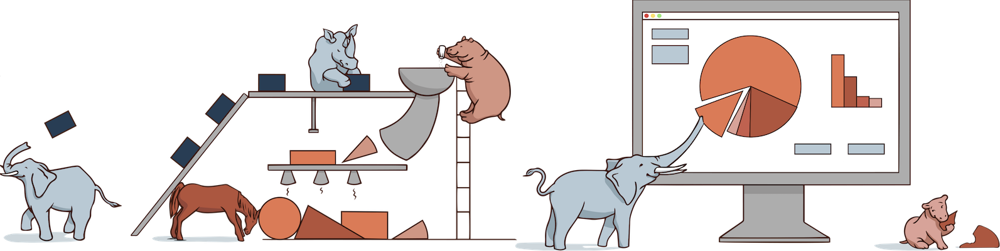

# ✔ Flexibility

The kaos core is built with [Pachyderm](https://pachyderm.github.io/), an open source language-agnostic tool for data pipelines. Pachyderm is committed to the notion that "_data scientists should be able to focus on data science, not infrastructure_". The main benefits of using Pachyderm are listed below.

* **Reproducibility**
  * Consistently recreate results from any previous state of your data or analysis
* **Data Provenance**
  * Understand every step of the process that produced a given result
* **Collaboration**
  * Manage shared data resources and work more effectively as a team
* **Incrementality**
  * Build upon past results by only processing the new data for maximum performance
* **Data Science Autonomy**
  * Maintain complete control of your data science toolchain choices
* **Infrastructure Agnostic**
  * Run in the cloud or on-premise and integrate easily with your current infrastructure

kaos augments the core Pachyderm building blocks by creating **dynamic** pipelines with **dynamic** environments \(i.e. Docker images\) for deploying hosted notebooks, training jobs and running endpoints.


kaos leverages **all the benefits** of Pachyderm for ensuring full "processing freedom"


