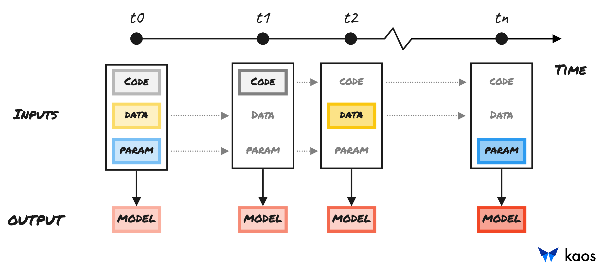

# ✔ Incremental Development

The natural **iterative** and **incremental** problem solving approach of forming, testing and validating hypotheses is present in kaos. Machine learning is similar to any problem with unknown dimensionality, which requires continual improvement towards a desired end goal \(i.e. a specific metric or desired KPI\).

kaos simulates this process by allowing **any number of** **training inputs** - code, data and/or params. A simplified conceptual example is presented below.



| Inputs | kaos Command |
| :--- | :--- |
| Code, Data, Params | `kaos train deploy -s <code> -d <data>` |


Resulting model trained with **incorrect architecture**




| Inputs | kaos Command |
| :--- | :--- |
| Code with **correct** architecture | `kaos train deploy -s <code>` |


Resulting model trained with **poorly labelled training dataset**




| Inputs | kaos Command |
| :--- | :--- |
| Data with **relabelled** training data | `kaos train deploy -d <data>` |


Resulting model trained with **assumed learning rate**




| Inputs | kaos Commands |
| :--- | :--- |
| Hyperparameters with **range** of learning rates | `kaos train deploy -h <hyperparams>` |


Resulting model **satisfies** the desired KPI!





kaos enables incremental processing when **any or all updated inputs are desired**


Check out the [Training Pipeline](../usage/high-level-usage/ml-deployment/train-pipeline.md) for detailed information regarding its inputs and outputs.

