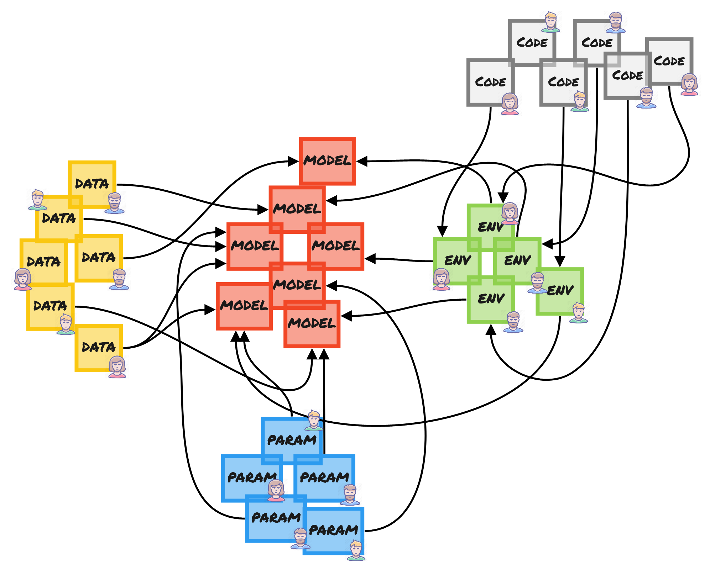

# ✔ Reproducibility

The complexity of machine learning exposes itself given its iterative nature and the many interdependencies of its inputs. A rather simple schematic depicting how trained models \(in red\) are dependent on data, parameters, environment and code. Complexity increases in magnitude when a fragmented team designs, builds, trains and productionizes multiple models.

The result are unanswerable questions such as "_which inputs were used for training?_", "_who wrote this code?_", "_how was this model tested?_", "_how well did the model perform?_"...


kaos solves this headache by ensuring **all artefacts are tracked and versioned**


Information is democratized instead of "owned" by a specific individual since the data lineage and metadata can be read by other users. The same schematic is presented but with kaos tracking all data inputs \(and outputs\).

Collaboration is handled within kaos by enforcing a mandatory [workspace](../usage/high-level-usage/ml-deployment/workspaces.md) for any number of users. It can be thought of as an independent "walled garden" for performing all work related to a specific task - i.e. improving the MNIST model.

