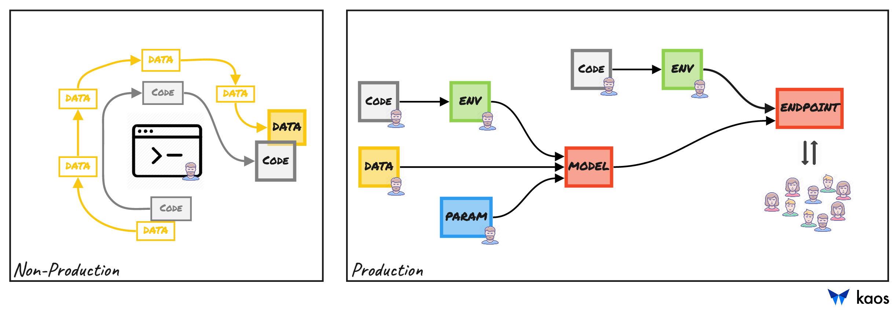

# Environments

The kaos platform provides the ability to develop in multiple environments. The main workflows within kaos highlight the different "stages" of Data Science work. A clear separation exists between non-production and production work. The transition between both "stages" is rather seamless but consists of a different toolset. A schematic of the distinction is presented below.

## **Non-Production**

**Non-production** work primarily involves experimentation within a hosted notebook. A notebook is an open-source web application for creating and sharing live code and visualizations. It is the ideal tool for experimentation, rapid prototyping, and testing. It can essentially be hosted anywhere, making it the ideal candidate within the kaos backend. Its integration within kaos allows for _unlimited_ users, an isolated environment and versioned shareable results. The intended process is an iterative "chaotic" workflow for experimentation - variations in data, features, code, frameworks, etc... The expected output is a set of features and code for training. This is highlighted above by the _final_ square **CODE** and **DATA** boxes.

## **Production**

**Production** work is focused on the standardization of how models are trained. The main input is the code for training ideas and concepts developed in the notebook environment. In other words, the square **CODE** and **DATA** boxes from the above diagram. The transition is necessary since experimentation is limited to a single user. Thus, moving to production is required to share knowledge and results amongst distributed teams. This is especially important when serving a model for predictions. Its lineage and provenance can be tracked back to its source \(i.e. the original square **CODE** and **DATA** boxes\).

