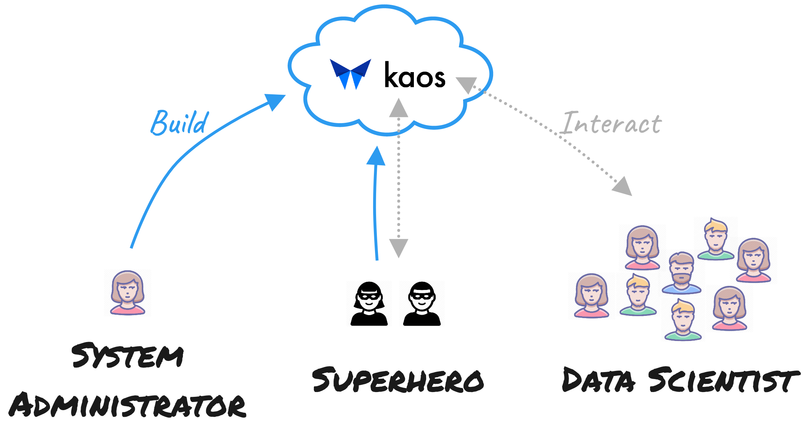

# Workflows

kaos is not functional as an ML platform **until it has been deployed in a user-specified cloud environment** \(i.e. via `kaos build deploy`\). Note that `kaos build deploy` is distinct from the _typical_ ML workflow in kaos since it should be done infrequently and with greater knowledge of underlying infrastructure.

## kaos Personas

The separation is purposely designed to split the intended user flows - **build** vs. **interact**. This aligns with the **three** intended kaos personas.



**Deploys** kaos infrastructure and generates a running endpoint via `kaos build deploy`

* Refer to [Build](infrastructure-deployment.md) for _high level concepts_ related to kaos deployment
* Refer to [Deploying Infrastructure](../../getting-started/deploying-infrastructure/) for _low level instructions_ on deploying kaos infrastructure



**Deploys** and **interacts** with kaos via `kaos build deploy`

* Refer to [Build](infrastructure-deployment.md) and [Interact](ml-deployment/) for _high level concepts_
* Refer to [Deploying Infrastructure](../../getting-started/deploying-infrastructure/) and [Quick Start](../../getting-started/quick-start.md) for _low level instructions_


Superheros have kaos automatically configured - `kaos init` can be **skipped!**




**Interacts** with kaos core \(i.e. experiment, train, serve, etc...\) via `kaos init`

* Refer to [Interact](ml-deployment/) for _high level concepts_ related to kaos usage
* Refer to [Quick Start](../../getting-started/quick-start.md) for _low level instructions_ on how to train and serve a model


Data Scientists **require an endpoint** from a System Administrator for `kaos init`




