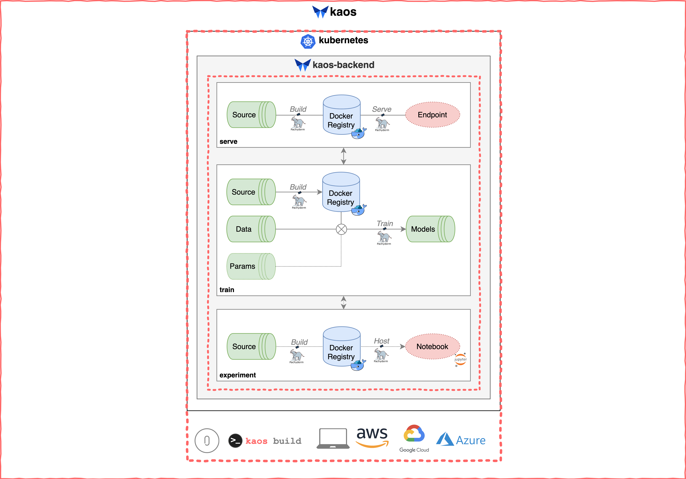

# Build

## Deployment

This involves deploying the underlying infrastructure within the selected compute environment. A running kaos backend \(via an authenticated endpoint\) indicates successful deployment.

The conceptual overview shown below indicates how `kaos build` deploys the entire kaos backend.



## General Usage


kaos is **only** available for Data Scientists with a running endpoint!


The kaos deployment portion of the command line interface \(CLI\) consists of the following **two** commands.

* `kaos build`
  * Configure, create and deploy the **kaos** infrastructure backend


`kaos build` **automatically** configures the newly deployed infrastructure


* `kaos destroy`
  * Remove all artifacts and shutdown running **kaos** infrastructure backend

Detailed instructions for deploying infrastructure in kaos can be found [here](../../getting-started/deploying-infrastructure/).

## Sharing Running Endpoint

The deployed **kaos** infrastructure backend is readily available for sharing with Data Scientists. A successfully deployed running endpoint can be found \(and shared\) in the following methods.

### kaos build

Successfully running `kaos build` will automatically display the current running endpoint on-screen.

In this example, the endpoint is `http://XYZ.amazonaws.com:80/api`.

```bash
$ kaos build -c AWS -e dev -vfy

...

Apply complete! Resources: 85 added, 0 changed, 0 destroyed.

Endpoint successfully set to http://XYZ.amazonaws.com:80/api/
Successfully built kaos [dev] environment
```

### kaos config

A kaos configuration file is always present in the current directory under `./kaos/config`. The following file is automatically created after running `kaos build`.



```text
[DEFAULT]
user = 

[backend]
url = http://XYZ.amazonaws.com:80/api/
token =
```




The endpoint running at`http://XYZ.amazonaws.com:80/api` can now be **shared** with Data Scientists!


