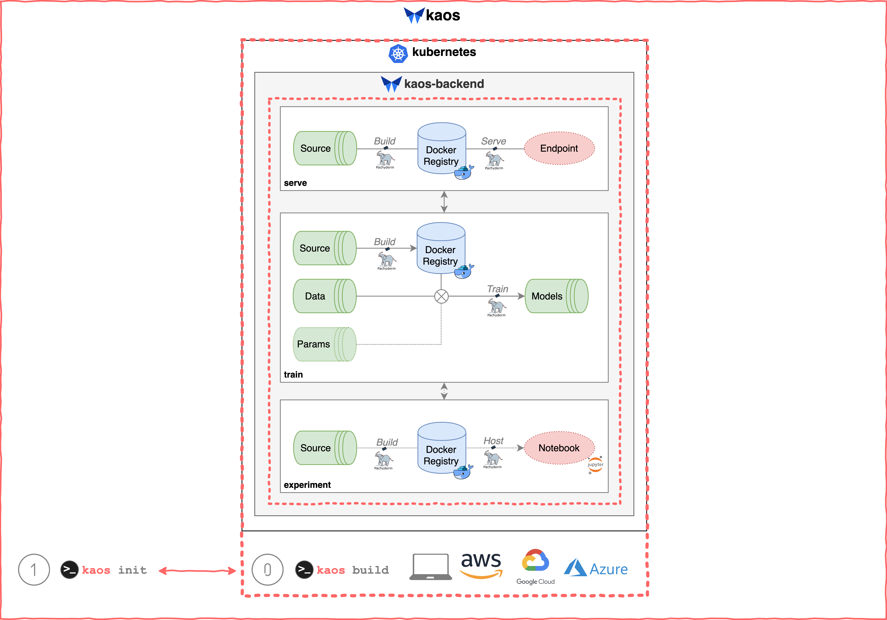
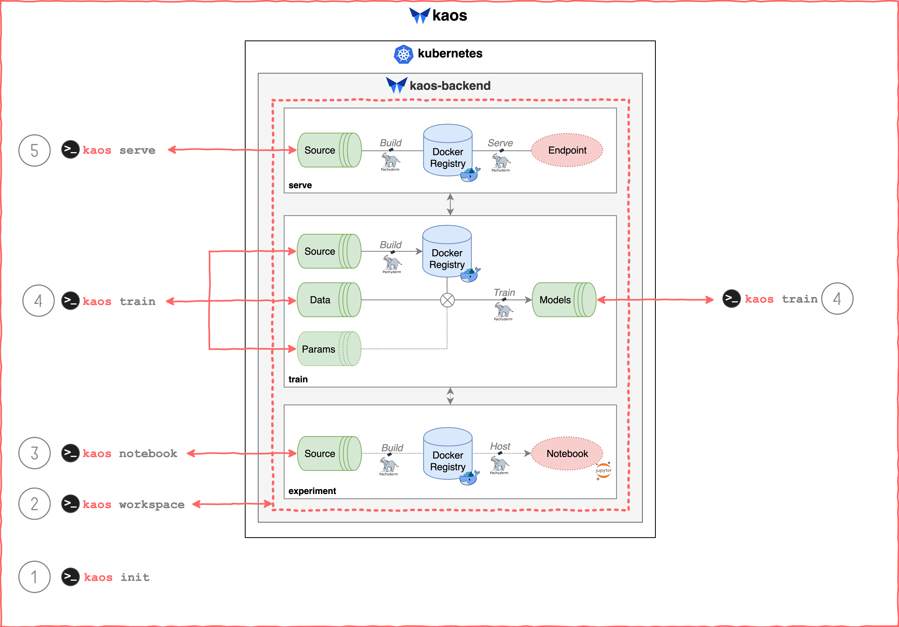

# Interact

## Initialization

The kaos ML platform is fully functional when initialized with a **running endpoint** \(see below\). See [Deploying Infrastructure](../../../getting-started/deploying-infrastructure/) for instructions on generating a running endpoint.

```bash
kaos init -e <running_endpoint>
```

This step is **mandatory** to ensure the end user \(i.e. Data Scientists\) is connected to kaos. Initialization can be thought of as the "glue" binding the backend and the command line interface \(CLI\). Once again, the following conceptual overview indicates how `kaos init` connects the end user the entire kaos backend.



## General Usage

The kaos CLI consists of the following top-level commands.

* `kaos init`
  * Initialize the **kaos** environment
* `kaos template`
  * Retrieves **templates** for getting started
* [`kaos workspace`](workspaces.md)
  * Organize and **separate** ML working environments
* [`kaos notebook`](notebook-pipeline.md)
  * Deploy hosted notebooks for **experimentation** and building ML models
* [`kaos train`](train-pipeline.md)
  * Create **training jobs** for training ML models with ready-made and split features
* [`kaos serve`](serve-pipeline.md)
  * Deploy an **endpoint** with a trained model

 Usage and sub-level commands are further detailed when running `--help`. For example, retrieving the `mnist` template for usage involves the following command:

```text
kaos template get --name mnist
```

The same conceptual overview is presented once again to highlight their "interaction" with the kaos backend.




