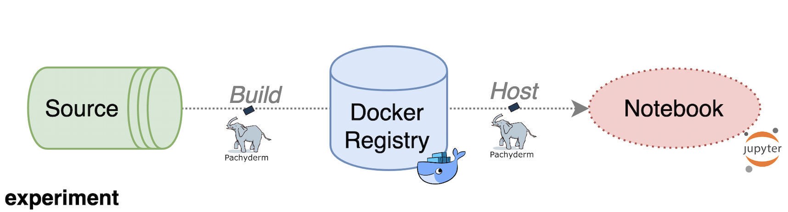

# Notebook Pipeline

The **Notebook Pipeline** consists of two stages - **Build** and **Host**. They are separate Pachyderm pipelines but are linked together to form a cohesive process. The user is able to identify and track progress \(and logs\) throughout both the **Build** and **Host** stages of the **Notebook Pipeline**. Status is shown via`kaos notebook list`, while logs are available via `kaos notebook build-logs`.



## Inputs

The Notebook Pipeline requires **nothing to deploy an empty hosted notebook** but can be optionally supplied with a valid **source bundle** and **data** **bundle.**


**Compression** of all input bundles is handled by kaos - not by the user!


### Source Bundle \(Optional\)

The source bundle is responsible for supplying the code and environment for deploying a notebook. Its nature should be treated as ephemeral and dynamic since versioning is handled with kaos. In other words, a user **does not need** to adapt chaotic naming conventions \(i.e. `notebook-v1`, `notebook-v1-latest`, `notebook-v1-final`, etc...\).

The source bundle **requires,** at minimum, the following basic structure.

```text
$ tree notebook

notebook
└── example
  ├── Dockerfile
  └── model
     └── requirements.txt
```


Submit the above bundle with `kaos train deploy -s notebook/example`


### Data Bundle \(Optional\)

The data bundle is responsible for submitting **local** data to the hosted notebook.


The data bundle _\*\*_can be any shape since the notebook has access to its content.


The sample **local** data bundle for the mnist model is shown below.

```text
$ tree mnist

mnist
└── data
  └── features
     ├── test
     │  └── test_mini.csv
     ├── training
     │  └── training_mini.csv
     └── validation
        └── validation_mini.csv
```


Submit the above with`kaos notebook deploy -d mnist/data`


### Resources \(Optional\)

Specific resources can be attached to any hosted notebook with the following options.

| Resources | kaos option | Description |
| :--- | :--- | :--- |
| Compute | `--cpu` | Float defining the desired compute \(in cores or time\) |
| Memory | `--memory` | String defining the desired memory \(**only** valid with SI suffixes\) |
| GPU | `--gpu` | Integer defining the desired graphical processing \(in cores\) |

