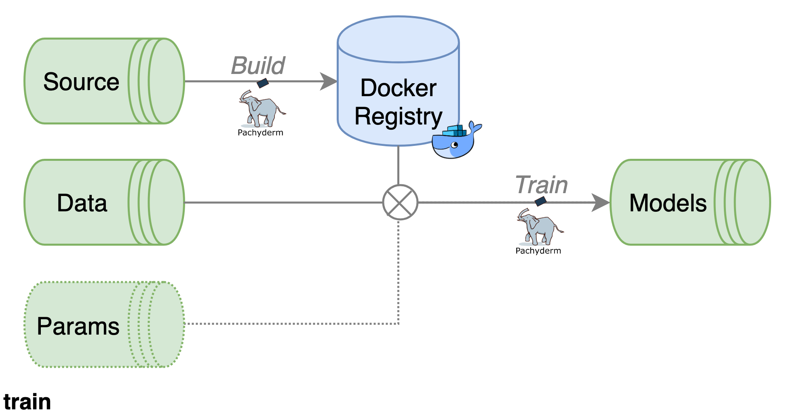

# Train Pipeline

The **Train Pipeline** consists of two stages - **Build** and **Train**. They are separate Pachyderm pipelines but are linked together to form a cohesive process. The user is able to identify and track progress \(and logs\) throughout both the **Build** and **Train** stages of the **Train Pipeline**. Progress is shown via`kaos train list`, while logs are available via `kaos train logs`.



## Inputs

The Train Pipeline requires **at least** a valid **source bundle** and **data** **bundle** for initiating a training job.


**Compression** of all input bundles is handled by kaos - not by the user!


### Source Bundle

The source bundle is responsible for supplying the code and environment for running a training job. Its nature should be treated as ephemeral and dynamic since versioning is handled with kaos. In other words, a user **does not need** to adapt chaotic naming conventions \(i.e. `mnist-v1`, `mnist-v1-latest`, `mnist-v1-final`, etc...\).

The source bundle **requires,** at minimum, the following basic structure.

```text
$ tree mnist

mnist
└── model-train
  └── mnist
     ├── Dockerfile
     └── model
        ├── requirements.txt
        └── train
```


Submit the above bundle with `kaos train deploy -s mnist/model-train`


### Data Bundle

kaos supports both **local** and **remote** data bundles for training.

#### Local

The data bundle is responsible for submitting **local** data necessary by the source bundle. The same "hands-off versioning" approach is also implemented for the data bundle. Submit data, train a model, change data, submit data, train a new model, etc... Rinse and repeat!


The data bundle _\*\*_can be any shape since only the`train` script \(in the source bundle\) needs to be able to access its content.


The sample **local** data bundle for the mnist model is shown below.

```text
$ tree mnist

mnist
└── data
  └── features
     ├── test
     │  └── test_mini.csv
     ├── training
     │  └── training_mini.csv
     └── validation
        └── validation_mini.csv
```


Submit the above with`kaos train deploy -d mnist/data`


#### Remote

The typical workflow involves handling relatively _big_ _data_ when training machine learning models. For this reason, kaos allows **remote** datasets for training with data manifest file\(s\).

The sample **remote** data manifest bundle for mnist is shown below.

```text
$ tree mnist

mnist
└── data_manifest_mid
  └── data.mf
```


Submit a **manifest file** with a this command:`kaos train deploy -m mnist/data_manifest_mid/data.mf`


#### Internal Structure

The following generalized JSON structure is required for the manifest file.

```text
{"url": string, "path": string}
```

The `"url"` specifies the remote address of the desired data, while `"path"` specifies the relative location within kaos for ingestion **based on the location of the manifest file**.

A small excerpt from the mnist training manifest file saved at `mnist/data_manifest_micro/data.mf` is highlighted below.

```text
{"url": "https://kaos-feature-store.s3.eu-central-1.amazonaws.com/test/mnist-split/xaaa.csv", "path": "test/xaaa.csv"}
{"url": "https://kaos-feature-store.s3.eu-central-1.amazonaws.com/test/mnist-split/xaab.csv", "path": "test/xaab.csv"}
{"url": "https://kaos-feature-store.s3.eu-central-1.amazonaws.com/training/mnist-split/xaaaa.csv", "path": "training/xaaaa.csv"}
{"url": "https://kaos-feature-store.s3.eu-central-1.amazonaws.com/training/mnist-split/xaaay.csv", "path": "training/xaaay.csv"}
{"url": "https://kaos-feature-store.s3.eu-central-1.amazonaws.com/validation/mnist-split/xaaa.csv", "path": "validation/xaaa.csv"}
{"url": "https://kaos-feature-store.s3.eu-central-1.amazonaws.com/validation/mnist-split/xaab.csv", "path": "validation/xaab.csv"}
```

The provided example will produce three top-level directories – `training`, `test` and `validation`.

### Params \(Optional\)

The inclusion of params is solely meant for hyperparameters jobs, where multiple parameters are tested at once \(in parallel\). A hyperparameter job will function properly when the supplied `train` script exposes parameters with `params` variable. An example excerpt from the `mnist` model is shown below. More details can be found when inspecting the source bundle from `kaos template get --name mnist`.

```python
def train():
    # load "static" params
    with open(params_fid, 'r') as src:
        params = json.load(src)

    # load params from "hyperopt" job
    params = hyperparams(params)

    <do stuff>

    classifier = svm.SVC(gamma=float(params['gamma']),
        decision_function_shape=params['decision_function_shape'],
        kernel=params['kernel'],
        degree=int(params['degree']))
```

The structure of a valid hyperopt input is a simple JSON with the correct keys \(as per `train`\). Note that **not all parameters need to be included for a hyperoptimization** - only those that should be adapted.

```javascript
{
  "degree": [
    3,
    4,
    5
  ],
  "decision_function_shape": [
    "ovo",
    "ova"
  ]
}
```


Submit the above bundle with `kaos train deploy -h <path/to/hyperparams.json>`


### Resources \(Optional\)

Specific resources can be attached to any training job with the following options.

| Resources | kaos option | Description |
| :--- | :--- | :--- |
| Compute | `--cpu` | Float defining the desired compute \(in cores or time\) |
| Memory | `--memory` | String defining the desired memory \(**only** valid with SI suffixes\) |
| GPU | `--gpu` | Integer defining the desired graphical processing \(in cores\) |

## Output

The result of the **Train Pipeline** is \(ideally\) a trained model but the user is completely "free" to save whatever they choose in the output directory. **This is defined based on the supplied `train` script in the Source bundle.** See [Examples](../../../advanced-workflows/examples/) for more information on output options.


There are absolutely **no restrictions** on the output from a training job!


